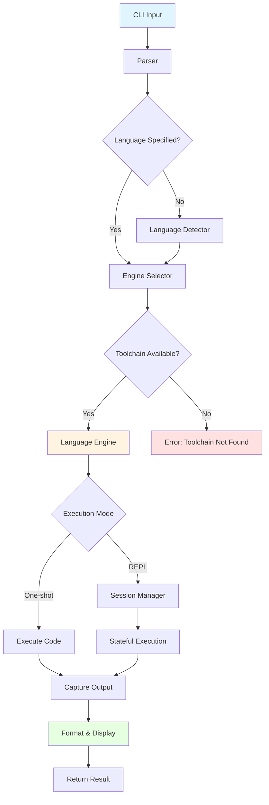

# run

<p align="center">
  <strong>Polyglot command runner & smart REPL that lets you script, compile, and iterate in 25+ languages without touching another CLI.</strong>
</p>

<p align="center">
  <a href="https://github.com/Esubaalew/run/releases/latest">
    
  </a>
  
  <a href="https://docs.rs/run-kit">
    
  </a>
  <a href="https://crates.io/crates/run-kit">
    
  </a>
  <a href="https://github.com/Esubaalew/run/releases">
    
  </a>
  <a href="https://github.com/Esubaalew/run/stargazers">
    
  </a>
  
  <a href="https://github.com/Esubaalew/run/blob/master/LICENSE">
    
  </a>
</p>

> Built in Rust for developers who live in multiple runtimes. `run` gives you a consistent CLI, persistent REPLs, and batteries-included examples for your favorite languages.

## Overview

run is a universal multi-language runner and smart REPL (Read-Eval-Print Loop) written in Rust. It provides a unified interface for executing code across 25 programming languages without the hassle of managing multiple compilers, interpreters, or build tools.

Whether you're a beginner learning your first programming language or an experienced polyglot developer, run streamlines your workflow by providing consistent commands and behavior across all supported languages.

### Who is this for?

- **Beginners**: Learn programming without worrying about complex setup procedures. Just install run and start coding in any language.
- **Students**: Quickly test code snippets and experiment with different programming paradigms across multiple languages.
- **Developers**: Prototype ideas rapidly, test algorithms, and switch between languages seamlessly without context switching.
- **DevOps Engineers**: Write and test automation scripts in various languages from a single tool.
- **Educators**: Teach programming concepts across multiple languages with a consistent interface.

### Why was run created?

Traditional development workflows require installing and configuring separate tools for each programming language. This creates several problems:

- **Time-consuming setup**: Installing compilers, interpreters, package managers, and configuring environments for each language.
- **Inconsistent interfaces**: Each language has different commands and flags for compilation and execution.
- **Cognitive overhead**: Remembering different commands and workflows for each language.
- **Barrier to entry**: Beginners struggle with setup before writing their first line of code.

run solves these problems by providing a single, unified interface that handles all the complexity behind the scenes. You focus on writing code, and run takes care of the rest.

### Why Rust?

run is built with Rust for several compelling reasons:

- **Performance**: Rust's zero-cost abstractions and efficient memory management ensure run starts instantly and executes with minimal overhead.
- **Reliability**: Rust's strong type system and ownership model prevent common bugs like null pointer dereferences and data races, making run stable and crash-resistant.
- **Cross-platform**: Rust compiles to native code for Windows, macOS, and Linux, providing consistent behavior across all platforms.
- **Memory safety**: No garbage collector means predictable performance without unexpected pauses.
- **Modern tooling**: Cargo (Rust's package manager) makes building and distributing run straightforward.
- **Future-proof**: Rust's growing ecosystem and industry adoption ensure long-term maintainability.

## Quickstart

```bash
run --version

run --lang python --code "print('hello, polyglot world!')"

run examples/go/hello/main.go

run

echo '{"name":"Ada"}' | run js --code "const data = JSON.parse(require('fs').readFileSync(0, 'utf8')); console.log(\`hi \${data.name}\`)"

echo "Hello from stdin" | run python --code "import sys; print(sys.stdin.read().strip().upper())"

echo "world" | run go --code 'import "fmt"; import "bufio"; import "os"; scanner := bufio.NewScanner(os.Stdin); scanner.Scan(); fmt.Printf("Hello, %s!\n", scanner.Text())'
```

## Installation

All release assets are published on the [GitHub Releases](https://github.com/Esubaalew/run/releases) page. Choose the method that works best for your system:

### Cargo (Rust)

```bash
cargo install run-kit
```

Installs the `run` binary from crates.io. Updating? Run `cargo install run-kit --force`.

### Homebrew (macOS)

```bash
brew install --formula https://github.com/Esubaalew/run/releases/latest/download/homebrew-run.rb
```

### Debian / Ubuntu

```bash
ARCH=${ARCH:-amd64}
DEB_FILE=$(curl -s https://api.github.com/repos/Esubaalew/run/releases/latest \
  | grep -oE "run_[0-9.]+_${ARCH}\\.deb" | head -n 1)
curl -LO "https://github.com/Esubaalew/run/releases/latest/download/${DEB_FILE}"
curl -LO "https://github.com/Esubaalew/run/releases/latest/download/${DEB_FILE}.sha256"
sha256sum --check "${DEB_FILE}.sha256"
sudo apt install "./${DEB_FILE}"
```

### Windows (Scoop)

```powershell
scoop install https://github.com/Esubaalew/run/releases/latest/download/run-scoop.json
```

### Install script (macOS / Linux)

```bash
curl -fsSLO https://raw.githubusercontent.com/Esubaalew/run/master/scripts/install.sh
chmod +x install.sh
./install.sh --add-path
```

### Build from source

```bash
git clone https://github.com/Esubaalew/run.git
cd run
cargo install --path .
```

### Verify installation

```bash
run --version
```

## How it works

`run` shells out to real toolchains under the hood. Each `LanguageEngine` implements a small trait that knows how to:

1. Detect whether the toolchain is available (e.g. `python3`, `go`, `rustc`).
2. Prepare a temporary workspace (compilation for compiled languages, transient scripts for interpreters).
3. Execute snippets, files, or stdin streams and surface stdout/stderr consistently.
4. Manage session state for the interactive REPL (persistent modules, stateful scripts, or regenerated translation units).

This architecture keeps the core lightweight while making it easy to add new runtimes or swap implementations.

### Architecture Flow



## Supported languages

run supports 25+ languages across multiple categories:

| Category | Languages & aliases |
| --- | --- |
| **Scripting & shells** | Bash (`bash`), Python (`py`, `python`), Ruby (`rb`, `ruby`), PHP (`php`), Perl (`perl`), Groovy (`groovy`, `grv`), Lua (`lua`), R (`r`), Elixir (`ex`, `elixir`) |
| **Web & typed scripting** | JavaScript (`js`, `node`), TypeScript (`ts`, `deno`), Dart (`dart`), Kotlin (`kt`, `kotlin`) |
| **Systems & compiled** | C (`c`), C++ (`cpp`, `cxx`), Rust (`rs`, `rust`), Go (`go`), Swift (`swift`), Zig (`zig`), Nim (`nim`), Haskell (`hs`, `haskell`), Crystal (`cr`, `crystal`), C# (`cs`, `csharp`), Java (`java`), Julia (`jl`, `julia`) |

## Examples

Real programs live under the `examples/` tree. Each language has `hello` and `progress` scenarios:

```bash
run examples/rust/hello.rs
run examples/typescript/progress.ts
run examples/python/counter.py
```

## REPL

Inside the REPL, you can use these commands:

| Command | Purpose |
| --- | --- |
| `:help` | List available meta commands |
| `:languages` | Show detected engines and status |
| `:lang <id>` or `:<alias>` | Switch the active language (`:py`, `:go`, …) |
| `:detect on/off/toggle` | Control snippet language auto-detection |
| `:load path/to/file` | Execute a file inside the current session |
| `:reset` | Clear the accumulated session state |
| `:exit` / `:quit` | Leave the REPL |

## License

Apache 2.0. See [LICENSE](https://github.com/Esubaalew/run/blob/master/LICENSE) for details.
