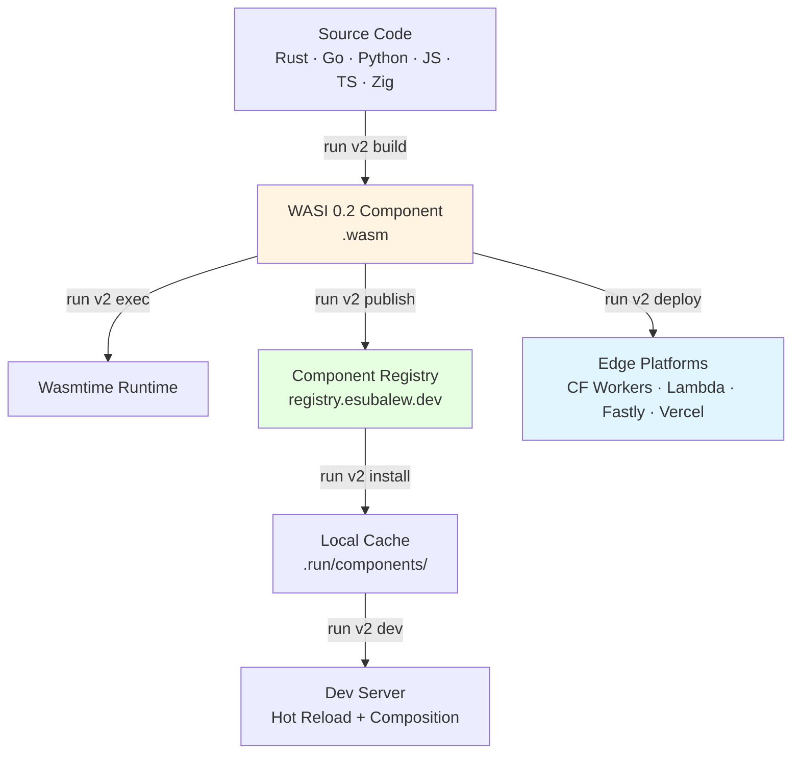

# Run 2.0 — WASI Component Runtime

Run 2.0 turns WebAssembly's Component Model into a practical developer tool. Build components in any language, compose them together, publish to a registry, and deploy anywhere — with instant startup, hermetic builds, and no Docker required for most workflows.

## The Problem

Every developer today deals with:

- **Dependency hell** — conflicting versions, platform-specific builds, "works on my machine"
- **Docker bloat** — 2GB images, 30-second startup, daemon overhead for simple services
- **Language silos** — want to use a Rust crypto library from TypeScript? Write FFI bindings. Good luck.
- **CI/CD complexity** — different build environments, flaky caches, non-reproducible artifacts

## The Solution

**WASI 0.2 components** solve all of these:

- A component is a **self-contained binary** (~KB to MB) that runs identically on macOS, Linux, Windows, edge, embedded
- Components **compose via typed interfaces** (WIT) — Rust calls Python calls Go, no FFI
- Components start in **milliseconds**, use **MB of RAM** (not GB)
- Builds are **reproducible by default** — same input, same binary, every time

Run 2.0 is the developer experience layer that makes this practical.

## What You Get

| Command | What It Does |
|---------|-------------|
| `run v2 init` | Create a project with a working starter component |
| `run v2 build` | Compile Rust, Go, Python, JS, TS, or Zig to WASI 0.2 components |
| `run v2 exec` | Run a component with strict determinism |
| `run v2 test` | Test components (config-defined or auto-discovered) |
| `run v2 dev` | Hot-reload dev server with component composition |
| `run v2 install` | Install components from the registry |
| `run v2 publish` | Publish components to the registry |
| `run v2 deploy` | Deploy to Cloudflare Workers, AWS Lambda, Fastly, Vercel |
| `run v2 info` | Inspect components (exports, size, type) |

## Architecture



## 30-Second Demo

```bash
# Create a project
run v2 init my-app
cd my-app

# Compile the starter component
wasm-tools parse components/hello.wat -o components/hello.wasm

# Execute it
run v2 exec components/hello.wasm --function greet --args "s32:42"
# → {"exit_code":0,"return_value":43}

# Run the included test
run v2 test
# → PASS greet_42
# → 1 passed, 0 failed

# Start the dev server
run v2 dev
# → 1 component ready (0.8ms)
```

## Run 1.0 vs Run 2.0

| | Run 1.0 | Run 2.0 |
|---|---------|---------|
| **Purpose** | Execute code in 25+ languages | Build & deploy WASI components |
| **Execution** | Native toolchains | WebAssembly runtime (Wasmtime) |
| **State** | REPL sessions | Component instances |
| **Distribution** | N/A | Component registry |
| **Deployment** | N/A | Edge platforms |
| **Composition** | N/A | Cross-language via WIT interfaces |

!!! info "Run 2.0 is additive"
    Run 2.0 does **not** replace Run 1.0. The polyglot runner (`run python`, `run rust`, etc.) still works exactly as before. Run 2.0 adds the `run v2` subcommand for WASI component workflows.

## Next Steps

- **[Installation](installation.md)** — Install Run with v2 support
- **[Quickstart](quickstart.md)** — Build your first component in 2 minutes
- **[Commands](commands.md)** — Full command reference
- **[Configuration](configuration.md)** — `run.toml` reference
- **[Registry](registry.md)** — Publish and install components
