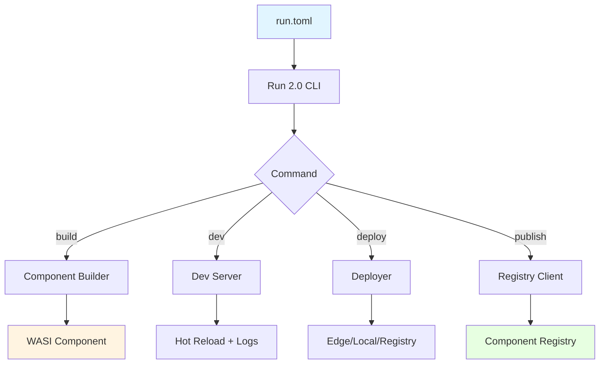

# Run 2.0 - WASI Component Runtime

Run 2.0 is an **experimental** extension that adds WASI 0.2 component support to Run. It enables cross-language composition, instant startup, hermetic builds, and edge deployment.

!!! warning "Experimental"
    Run 2.0 is experimental and opt-in. It does not replace Run 1.0's polyglot runner features.

## What Run 2.0 Adds

| Feature | Description |
|---------|-------------|
| **Cross-language composition** | Rust, Python, Go, JS components calling each other via WIT interfaces |
| **Instant startup** | <10ms cold start (vs Docker's 5-10 seconds) |
| **Hermetic builds** | Reproducible builds with toolchain lockfiles |
| **Edge deployment** | Deploy to Cloudflare Workers, AWS Lambda, Vercel |
| **Component registry** | Publish and install WASI components |

## Architecture



## Quick Example

```bash
# Initialize a new project
run v2 init my-app
cd my-app

# Build components
run v2 build

# Start development server
run v2 dev

# Publish to registry
run v2 publish --build
```

## Run 1.0 vs Run 2.0

| Feature | Run 1.0 | Run 2.0 |
|---------|---------|---------|
| Purpose | Execute code in 25+ languages | Build & deploy WASI components |
| Execution | Native toolchains | WebAssembly runtime |
| State | REPL sessions | Component instances |
| Distribution | N/A | Component registry |
| Deployment | N/A | Edge platforms |

## When to Use Run 2.0

Use Run 2.0 when you need:

- **Microservices** with instant startup and minimal resource usage
- **Cross-language** function calls (e.g., Python calling Rust)
- **Reproducible builds** for CI/CD pipelines
- **Edge deployment** to serverless platforms
- **Component reuse** via the registry

Continue using Run 1.0 for:

- Quick code execution and prototyping
- Interactive REPL sessions
- Running existing scripts in various languages

## Next Steps

- [Installation](installation.md) - Install Run with v2 support
- [Quickstart](quickstart.md) - Build your first component
- [Commands](commands.md) - Full command reference
- [Configuration](configuration.md) - run.toml reference
